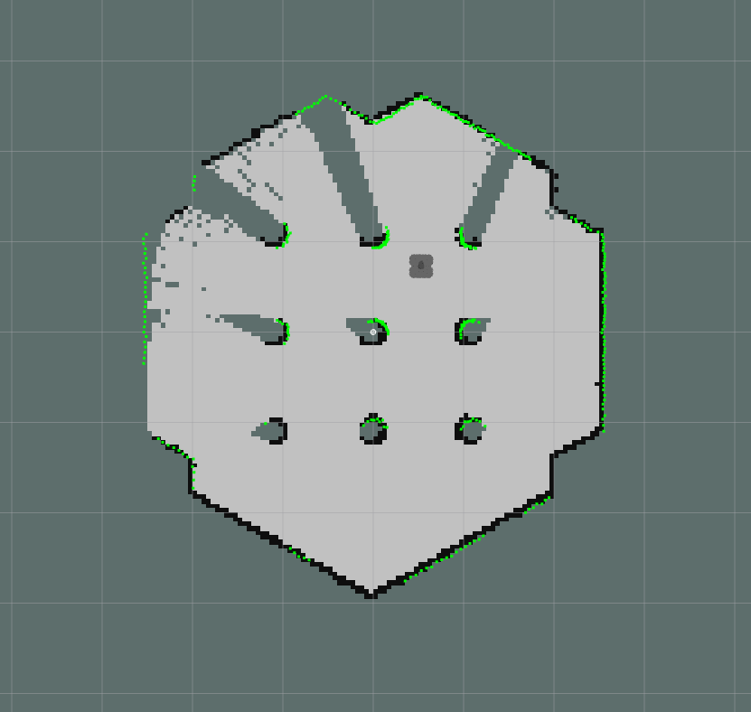
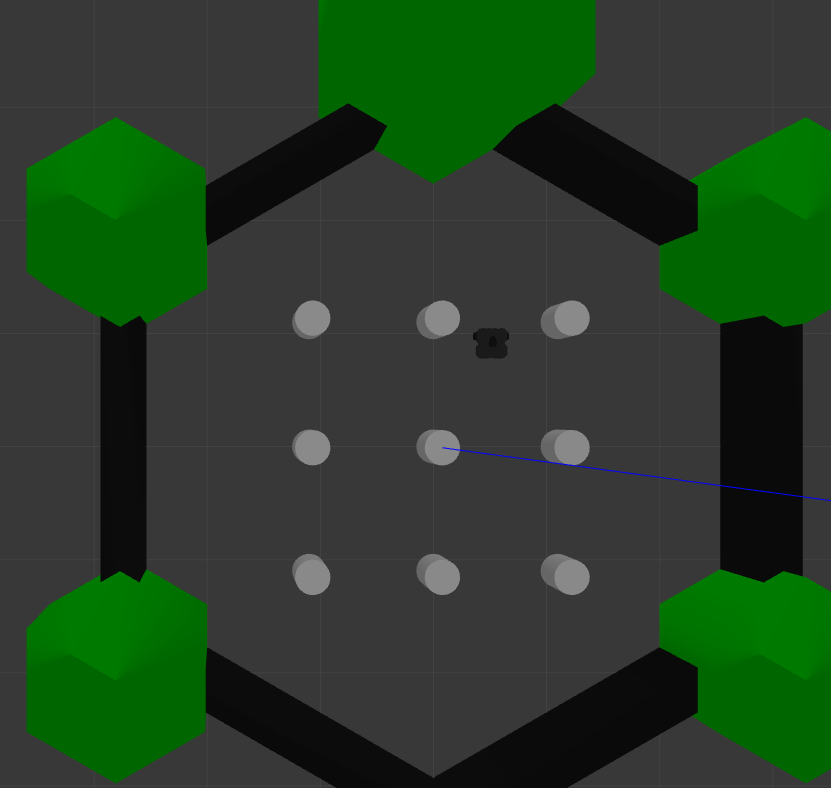
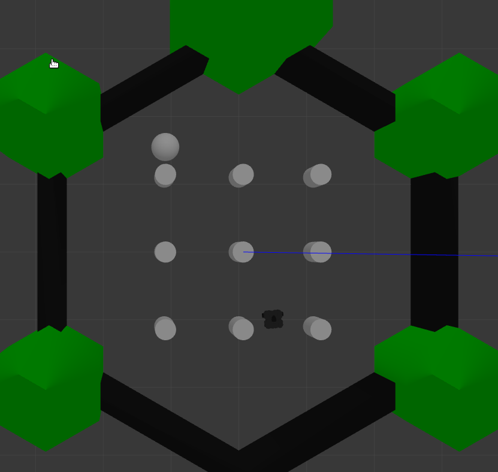

<h1 align="center"><p>Robot System Programming</p><p>VOT : Vision-based Object-tracking Turtlebot</p></h1>

### Contributors

#### Created and Maintained by:  
 - [Jiaming Zhang](https://github.com/jeremyzz830): JHED ID : jzhan282  

 - [Yixun 'Daniel' Wang](https://github.com/DanielW1112): JHED ID : ywang317  

 - [Tianyi Weng](https://github.com/WengTianyi): JHED ID : tweng1  

<h4 align="right">
<p>May 13rd 2022</p>
<p>@ Johns Hopkins University</p> 
</h4>

<br></br>
# Table of Content
0. [Introduction](#0-Introduction)
1. [Prerequisites](#I-Prerequisites)
2. [Running Tutorial](#II-Running-Tutorial)
3. [Simulation Demo](#IV-Simulation-Demo)


<br></br>
# 0. Introduction
This repository is for the final project of EN 530.707 Robot System Programming. The goal for our project is to develop a stack of packages that can conduct autonomous SLAM, autonomous object tracking and following. There are two repositories for this project. The repo with –Sim suffix contains all the packages needed to run simulation. And the repo with –Pro suffix provides all the packages needed to perform the tasks on the prototype. The links to these repositories are as follows:  
 - [RSP-Project-VOT-Sim](https://github.com/jeremyzz830/RSP-Project-VOT-Sim) : -Sim is short for simulation
<br></br>
 - [RSP-Project-VOT-Pro](https://github.com/jeremyzz830/RSP-Project-VOT-Pro) : -Pro is short for prototype
 
 > for more detials about packages, nodes and topics, please check [Docs/Docs.md](Docs/Docs.md)
 


<br></br>
# I. Prerequisites

## 1.1 System Setting
### ubuntu
This repo is created under Ubuntu 18.04LLTS Bionic Beaver.
<br></br>
### ros required package

Create a empty workspace before start like this:
```bash
$ mkdir -p vot_ws/simulation/src
```
```bash
$ sudo apt-get install ros-melodic-timed-roslaunch
$ cd vot_ws/simulation/src
$ git clone https://github.com/ros-perception/slam_gmapping.git
```
<br></br>
### bashrc
```bash
export turtlebot_model=waffle_pi
```
```bash
source ~/.bashrc
```
<br></br>
## 1.2 Installation

### 1.2.1 git clone own repo
```bash
$ cd vot_ws/simulation/src
$ git clone https://github.com/jeremyzz830/RSP-Project-VOT-Sim.git
```

### 1.2.2 build the repo
```bash
$ cd vot_ws/simulation
$ catkin build 
```

### 1.2.3 rosdep
```bash
rosdep install --from-paths src --ignore-src -r -y
```

<br></br>
<br></br>
# II. Running Tutorial
## Usage
#### start_simulation.launch
To launch this part, type the following command in a new terminal:
```bash
$ roslaunch my_tbot3_sim start_simulation.launch 
```
This launch file offers a basic overview. It will launch an environment in the Gazebo and spawn the model for Turtlebot3. It will also start the teleop interface so that the turtlebot3 can be driven around the environment. Lastly, it will also start RVIZ to display the scan results of the LiDar.  

#### project_init.launch
To launch this part, type the following command in a new terminal:
```bash
$ roslaunch my_tbot3_workcontrol project_init.launch  
```
This is the first “real” section of our project. “control_mode” is by default as “auto”, which allows turtlebot to autonomously navigate and avoid obstacles during map building. To manually navigate turtlebot, please add the command “control_mode:=teleop” to use keyboard for robot motion control. This launch file brings up Gazebo, Rviz, SLAM, and nodes “controller_node” and “rqt_reconfigure”. Inside the rqt_reconfigure interface, by choosing “controller_node” and then “Switch_to_navigation” , the dropdown offers an option to terminate SLAM map building process. Selecting “yes(1)” to stops all nodes and map will be saved to the path “/home/the $USER/Downloads/map”. 

#### nav_simulation.launch
To launch this part, type the following command in a new terminal:
```bash
roslaunch my_tbot3_nav nav_simulation.launch 
```
This is the second section of our project. This launch file will launch Gazebo and RVIZ. Initially, the robot will be placed in a patrol mode and travel around the simulated environment by following a set of pre-determined waypoints. Via a random number generator, at certain time, the robot will be asked to move in front of the ball. 

## Workflow
Step1 :
```bash
$ roslaunch my_tbot3_workcontrol project_init.launch control_mode:=auto
```
This command will start the SLAM process with autonomous driving for the robot.  

Step2 :  

Once the map is complete, use the dynamic reconfigure GUI and switch the “Switch_to_Navigation” button from “NO” to “YES”. This will then trigger a shutdown sequence that automatically saves the map (into the Downloads folder) and terminates the node. Use “ctrl C” to shut down any remaining node.

Step 3.  
```bash
$ roslaunch my_tbot3_nav nav_simulation.launch 
```
This launch file will start several features.  
1. Start RVIZ and Gazebo and launch with the map saved in the previous step.  
2. Place a ball into the Gazebo as the target. 
3. Start an initializing node, “nav_simulation_init_node”, for placing the robot in the simulation world in preparation for 2D Navigation.  
4. Start “fake_goal_node”. This node publishes navigation goals to “/fake_goal” Topic in geometry_msgs/Point. The node also subscribes to the “move_base/result” Topic to monitor the results of robot’s actions.  

As the goals are published, the “nav_simulation_init_node” subscribes to the topic and transcribes the goal as a geometry_msgs/PoseStamped message to publish to the “/move_base_simple/goal”. Initially, the robot will be put in a patrol mode that circles the environment. Each time the robot reaches a navigation goal, a random integer will be generated between 1 and 10, and if the number is 1, the robot will be asked to travel to the ball, which is the final navigation goal.  

# IV. Simulation Demo

## For map generation with gmapping
```bash
$ roslaunch my_tbot3_workcontrol project_init.launch control_mode:=auto
```




## For navigation and goal detection
```bash
$ roslaunch my_tbot3_nav nav_simulation.launch 
```




